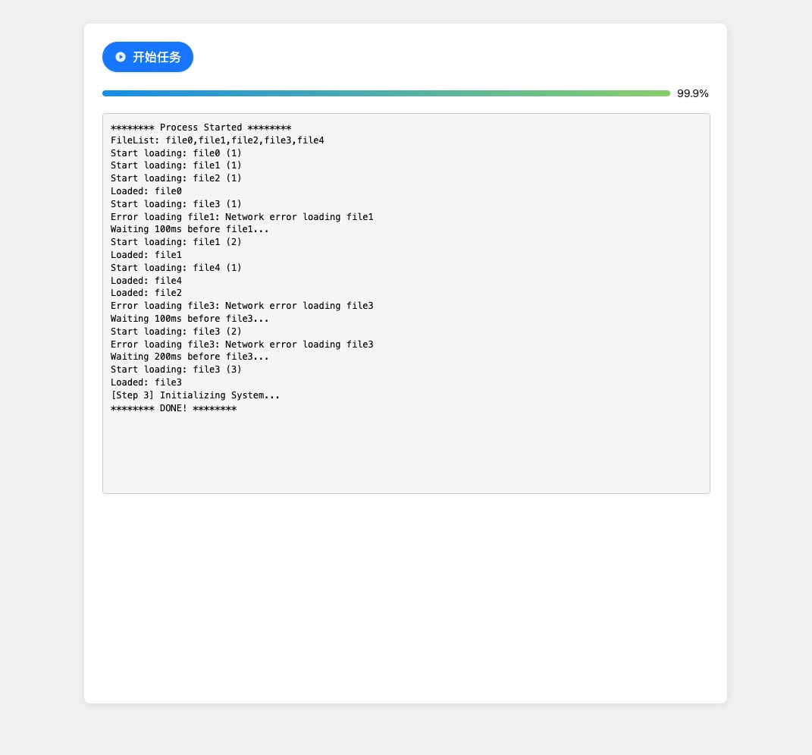
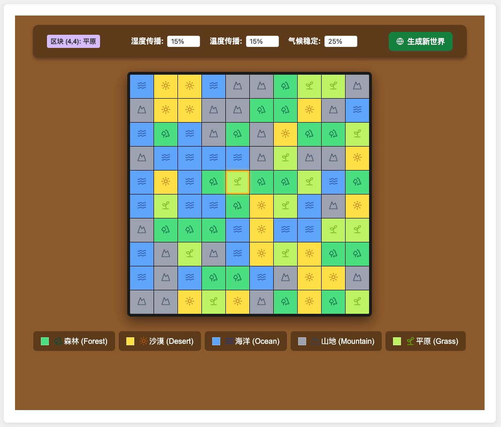

# JoyCastle-Code
JoyCastle Test Code

## 运行前准备
1. 环境: Node v20.18, yarn
2. 安装依赖: `yarn install`
3. 测试运行: `yarn start`

说明: 如果出现`Error: Cannot find module`的错误，可能是因为umi本身缓存，尝试删除`src/.umi`后重试

## 题目1:任务处理器
效果如下图: 

## 题目2:生物群系生成系统
效果如下图：
